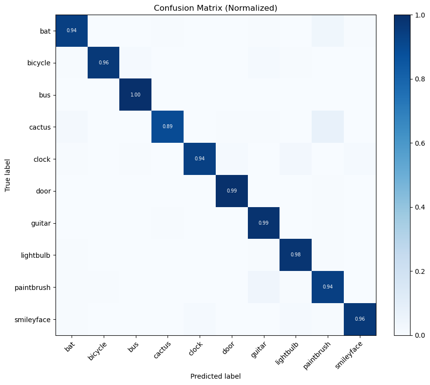
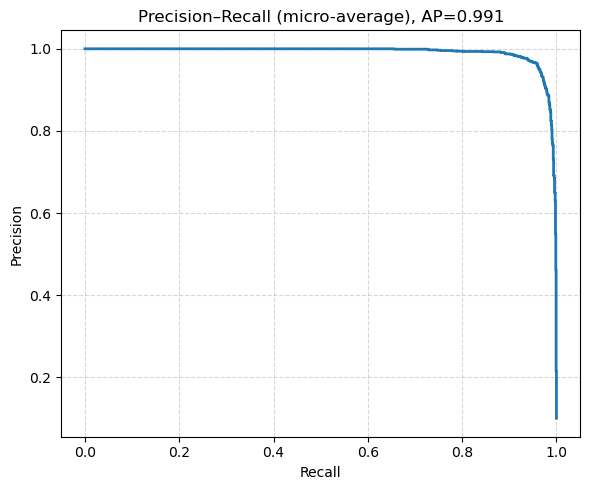
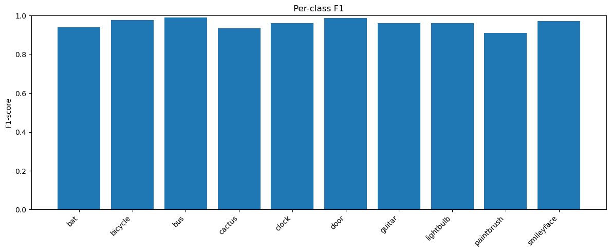
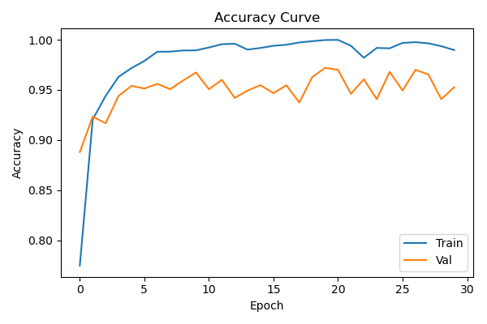
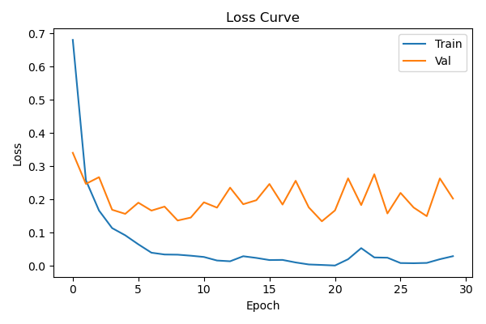
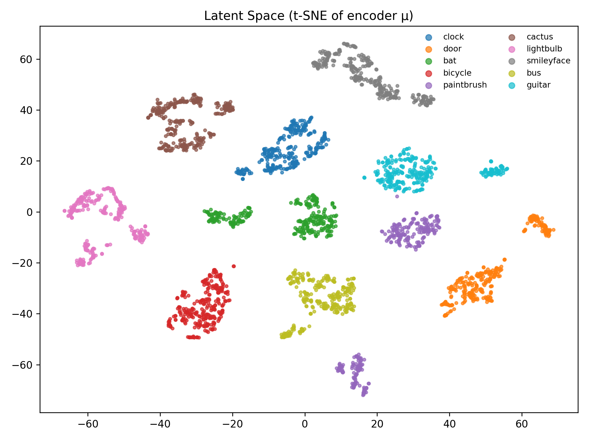
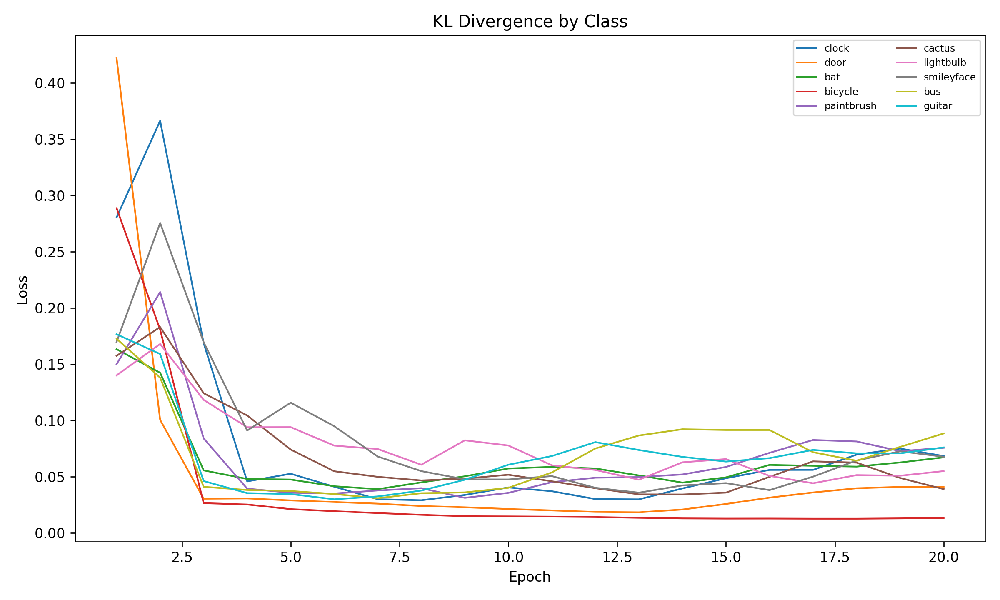
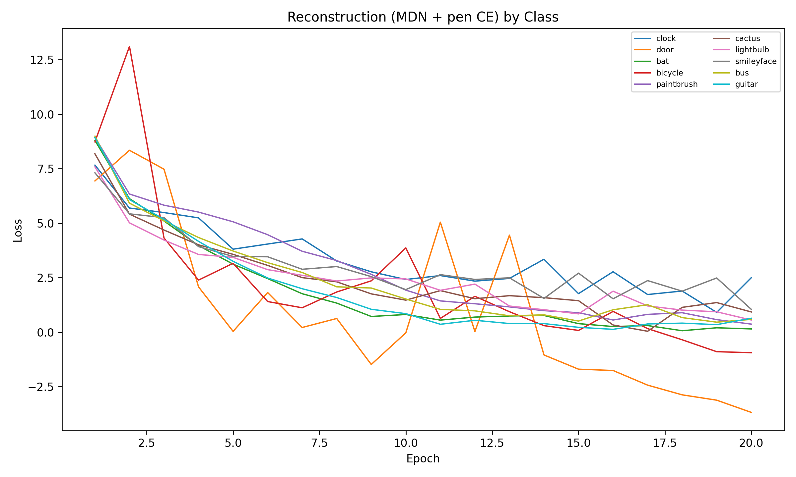
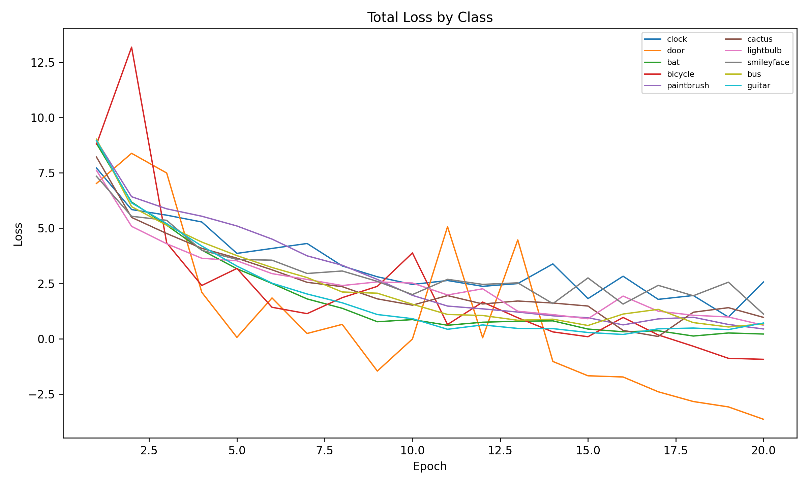

# SketchCoder

A **real-time web application** for interactive sketch **classification** and **generation**. Built with a React frontend and a Flask backend, the system demonstrates end-to-end pipelines for recognizing hand-drawn sketches and generating class-conditioned doodles using deep learning models.

---

## 📖 Project Description

SketchCoder combines two core tasks:

* **Classification**: Users can draw on a canvas, and the trained CNN model predicts the object class among 10 categories.
* **Generation**: Users can select a category (e.g., *bus*, *guitar*) and the generative RNN will produce a novel sketch in that class.

The project demonstrates a **full ML lifecycle**: dataset preparation, preprocessing, model training , backend APIs, and an interactive frontend.


---

## 📂 Dataset

We use the Google Quick, Draw! dataset, a large-scale crowdsourced collection of millions of doodles across hundreds of categories. Each doodle is stored in NDJSON format (newline-delimited JSON), where each line corresponds to one drawing.
* **Structure**: Each record contains metadata (`key_id`, `word`/category label, `countrycode`, `timestamp`, recognition flag) and the actual drawing strokes.
* **Drawing representation**: The `drawing` field is an array of stroke sequences, where each stroke is a list of x-coordinates, y-coordinates, and pen states. This makes it suitable for both raster classification and sequence-based generative modeling.
* **Classes used (10)**: `bat`, `bicycle`, `bus`, `cactus`, `clock`, `door`, `guitar`, `lightbulb`, `paintbrush`, `smileyface`.
* **Train/Test split**: \~80/20 per class.

---

## 🧹 Preprocessing

### Classification

1. Convert user canvas to PNG.
2. Convert to grayscale.
3. Threshold to binarize strokes.
4. Crop to bounding box, pad to square.
5. Resize to 64×64.
6. Normalize pixel values.


### Generation

1. Load raw stroke sequences from Quick, Draw! NDJSON.
2. Normalize (Δx, Δy) by sequence length and standard deviation.
3. Represent pen states as one-hot vectors `[p1, p2, p3]`.
4. Package as sequences of `[Δx, Δy, p1, p2, p3]`.

---

## 🏗️ Architectures & Data Pipelines

### Classification: SketchCNN


**Pipeline:**


---


### Generation: GenerateRNN (Sketch-RNN style)


**Pipeline:**


---

## 📊 Results

### Classification Performance

* **Accuracy**: 96.0%
* **Macro F1**: 0.959
* **Average Precision (micro)**: 0.991

**Per-class metrics:**

| Class      | Precision | Recall | F1-score |
| ---------- | --------- | ------ | -------- |
| bat        | 0.939     | 0.939  | 0.939    |
| bicycle    | 0.994     | 0.963  | 0.978    |
| bus        | 0.978     | 1.000  | 0.989    |
| cactus     | 0.984     | 0.892  | 0.936    |
| clock      | 0.987     | 0.936  | 0.961    |
| door       | 0.982     | 0.994  | 0.988    |
| guitar     | 0.935     | 0.988  | 0.961    |
| lightbulb  | 0.944     | 0.978  | 0.961    |
| paintbrush | 0.882     | 0.940  | 0.910    |
| smileyface | 0.981     | 0.963  | 0.972    |

** Plots **

- **Confusion Matrix** – shows class-wise prediction performance.


- **Precision–Recall Curve (micro-average)** – confirms balanced precision/recall.


- **Per-class F1 Scores** – demonstrates high performance across all categories.


- **Accuracy Curve** – tracks accuracy over epochs.


- **Loss Curve** – tracks loss reduction across training.



---

### Generation Plots

- **Latent Space t-SNE** – shows class-separable clusters in the learned latent space.


- **KL Divergence by Class** – demonstrates rapid decrease and stabilization of KL loss.


- **Reconstruction Loss (MDN + pen CE)** – shows decreasing reconstruction error with fluctuations across categories.


- **Total Loss by Class** – combines KL and reconstruction losses, converging smoothly around epoch 15–20.


---

## ⚙️ Setup & Installation

### Using Conda (recommended)

```bash
# Recreate environment
conda env create -f environment.yml

# Activate environment
conda activate sketchbot-env

# Run backend
cd ~/Desktop/SktechBot/backend
python app.py

# Deactivate when done
conda deactivate
```

### Using requirements.txt

```bash
cd backend
python -m venv venv
source venv/bin/activate   # Windows: venv\Scripts\activate
pip install -r requirements.txt
python app.py
```

### Frontend

```bash
cd frontend
npm install
npm run dev
```

Access at: [http://localhost:3000](http://localhost:3000)

---

## Future Work

* Extend to **Transformer/attention-based generators** for richer sketches.
* Add **stroke-by-stroke playback animation** in frontend.
* Confidence calibration for **reliable rejection of uncertain predictions**.
* Expand dataset to more categories.
* Deploy with **Docker + cloud hosting** for broader access.

---

## Acknowledgments

* **Professor Sarp Akcay**, University College Dublin — for invaluable guidance and supervision throughout the course project.
* **Google Quick, Draw! dataset** — for providing large-scale sketch data.
* Research inspiration from **SketchRNN** (Ha & Eck, 2017).

